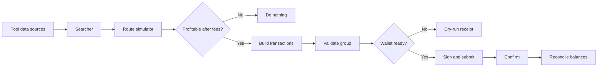
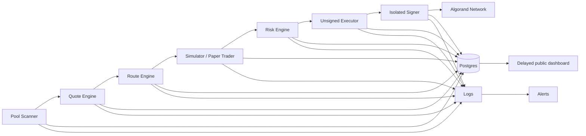
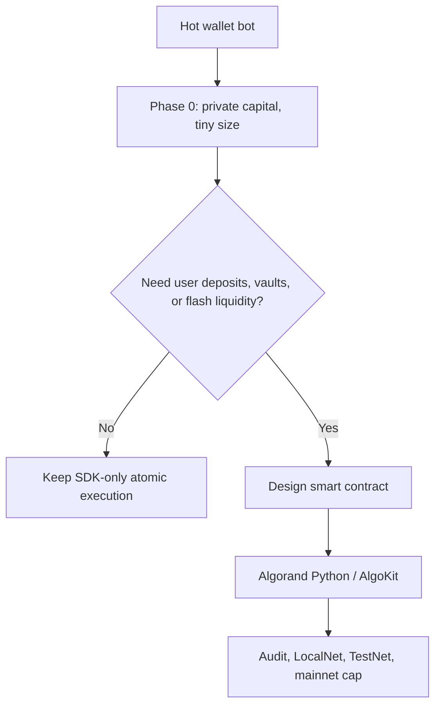

# Real Arb Bot Architecture

This is the target architecture for moving AlgoPulse from a live scanner into a real, guarded Algorand arbitrage bot.

## Short Answer On PyTeal

No, this Phase 0 bot does not need PyTeal just to perform basic DEX arbitrage.

For simple two-leg arb on Algorand, the normal path is:

1. Use off-chain code to scan pools and find a route.
2. Use DEX SDKs to build swap transactions.
3. Group the transactions atomically.
4. Sign with a hot wallet.
5. Submit the group.

Algorand atomic transaction groups are native: the group succeeds together or fails together. That means a simple two-leg route can be atomic without deploying a custom smart contract.

Use smart contracts only when we need custom on-chain behavior:

- pooled capital vault
- escrowed strategy account
- flash-liquidity callback logic, if supported by a protocol
- custom profit-split or fee logic
- on-chain invariant checks
- permissioned operator controls
- user deposits or withdrawals

If we do need new smart contracts, prefer the current AlgoKit / Algorand Python path for new work unless there is a specific reason to use PyTeal.

## How Web3 Arb Bots Actually Work

Most arb bots have two halves: an off-chain searcher and an on-chain execution path.

## Target Production Service Chain

This is the service split to build toward after the Phase 0 local app proves useful:

The important founder-level rule: the unsigned executor and isolated signer are different trust zones.

- The scanner, quote engine, route engine, simulator, and risk engine can run as normal backend services.
- The unsigned executor can build and validate transaction groups from risk-approved opportunities, but it must not hold signer secrets or approve routes by itself.
- The isolated signer should receive only an already-reviewed unsigned group plus execution metadata, revalidate the group, sign, submit, and emit the receipt.
- The public dashboard should read delayed/redacted data only. It should never expose fresh executable routes, signer health internals, signer secrets, raw production logs, or private inventory.

Phase 0 Step 9 implements the signer as a policy boundary in `src/algopulse/signer.py`. It validates and signs but does not discover routes, choose trades, or submit to the network yet. The main executor now stops at a signer handoff receipt instead of signing directly.

Phase 0 Step 10 adds tiny-live readiness gates for the first ALGO/USDC-only execution. Tiny live mode is not broad live trading: it requires a new 100-250 ALGO hot wallet, 10 ALGO max trade size, 20 ALGO max daily loss, 20 max daily trades, manual route-hash approval, Lora verification, and expected-vs-actual reconciliation before any tiny automation.

Shared infrastructure should be treated as part of the product, not an afterthought:

- Postgres stores pools, quotes, routes, paper trades, risk decisions, execution receipts, balance reconciliations, payment verifications, and refund cases.
- Logs capture structured service events with route hashes, pool ids, app ids, asset ids, decisions, and error codes.
- Alerts trigger on stale scans, quote failures, repeated rejected execution groups, signer rejections, submitted trade variance, low ALGO fee balance, indexer outages, and refund cases needing review.
- Delayed public dashboard reads a safe projection from Postgres, ideally with a delay of at least `ALGO_PULSE_PUBLIC_DELAY_SECONDS`.

## Minimum Database Schema

These are the minimum production tables. Phase 0 uses SQLite with the same table names; production should move this shape to Postgres.

| Table | Owns |
| --- | --- |
| `assets` | ASA/ALGO metadata, allowlist status, decimals, freeze/clawback flags |
| `venues` | executable venues and data venues such as Tinyman, Pact, and later integrations |
| `pools` | stable pool identity, venue, app ID, pair assets, fee bps, active status |
| `pool_snapshots` | reserve/time-series observations from scanner runs |
| `quotes` | quote-comparison and route-leg simulation records: venue, pool, input/output assets, input amount, expected output, fee estimate, price impact, block round, captured_at, expires_at |
| `opportunities` | candidate routes, gross/net profit breakdown, network fee estimate, DEX fee estimate, price impact, slippage buffer, confidence, skip reason, status, and route JSON |
| `paper_trades` | candidate paper replay receipts with would-execute/skip status, simulated output, quote decay, and expected-vs-simulated profit deltas |
| `risk_decisions` | approval/rejection evidence and risk-rule output |
| `live_trades` | dry-run/submitted execution receipts and transaction metadata |
| `service_health` | health snapshots for scanner, worker, quote, executor, and signer services |
| `alerts` | operator alerts for stale data, signer rejects, low balances, drift, and refund review |

Related Phase 0 tables already include balance reconciliation, payment verification, and refund cases. Future Postgres additions can include signer policy versions and dashboard projection tables. The listed tables are the minimum spine.

## Automation Boundary

The production bot should automate the work that makes markets observable and decisions auditable:

- automated scanning
- automated quote comparison
- automated paper-trading
- automated risk rejection
- automated unsigned transaction construction

Automated signing is allowed only inside a tiny, isolated, policy-limited signer. That signer should:

- keep signer secrets outside the scanner/API process
- accept only unsigned transaction groups plus narrow execution metadata
- reject arbitrary instruction fields from the executor
- revalidate route hash, route intent, app IDs, asset IDs, input amount, transaction count, group id, group size, fees, transaction types, sender wallet, wallet reserve, rekey fields, and close-out fields
- enforce max trade size, allowed asset pairs, allowed venues, and allowed account
- check a kill switch before approval
- log every approval or rejection without logging signer secrets or signed transaction blobs
- reject any route that lacks a fresh risk approval and balance/reconciliation plan
- emit a signed/submitted receipt or a structured rejection reason

This keeps the main bot highly automated while preventing one bug in scanning or routing from becoming unlimited signing authority.

## Security Non-Goals

The architecture is invalid if any of these become true:

- AI has wallet keys.
- Frontend code has wallet keys.
- A main wallet signs trades.
- An unknown repo or unreviewed service signs transactions.
- The bot trades every asset it sees.
- The bot accepts user funds.
- The bot does sandwich attacks or predatory MEV.

The product should be a private, policy-limited arbitrage operator for reviewed assets and venues. It should not become a custody app, public deposit product, universal asset trader, or adversarial MEV system.

## The Searcher

The searcher watches market state and asks:

- Which pools exist for the target asset?
- Which venues have the same pair?
- What are current reserves?
- What are fees?
- What route sizes are realistic?
- Is there a spread after price impact?
- Is expected profit still positive after network fees and safety buffer?

The scanner side of the searcher is read-only. It collects venue, pool ID, app ID, asset pair, reserves, fee bps, liquidity estimate, spot price, block round, timestamp, and freshness. It must not require wallet keys or a signer.

For this repo, the initial searcher is:

- Vestige for PNET pair discovery.
- Tinyman/Pact SDK calls for executable live pool state.
- `RouteEngine` for two-leg venue arb and ALGO/ASA/USDC triangle discovery.
- `RiskEngine` for approval/rejection.

Current route shapes:

- `ALGO -> USDC on Tinyman -> ALGO on Pact`
- `ALGO -> ASA on Pact -> ALGO on Tinyman`
- `ALGO -> ASA -> USDC -> ALGO`
- `ALGO -> USDC -> ASA -> ALGO`

Three-leg triangle routes are scanner/paper-trade candidates only in Phase 0. The live executor still rejects non-two-leg routes until 3-leg transaction construction, group sizing, app ID validation, fee ceilings, and reconciliation are explicitly reviewed.

## Connector Roadmap

Phase 0 executable venues:

- Tinyman
- Pact

Later data and route expansion:

- Vestige data for richer market intelligence, target-pool discovery, liquidity ranking, historical context, and sanity checks.
- Folks routes when executable route construction, fees, slippage assumptions, app IDs, and balance reconciliation can be reviewed end to end.
- Other Algorand AMMs only after connector math, SDK transaction construction, app-call validation, and quote freshness are covered by tests.

Do not blur data sources and execution venues. Vestige can help decide what to watch, but Tinyman/Pact are the first sources for executable pool state and transaction construction. Folks and route aggregators should be treated as new execution surfaces with their own risk review.

## Route Pair Policy

The first serious route universe should center on ALGO and USDC because they make accounting, exits, and fee budgeting easier:

1. ALGO / USDC
2. ALGO / major ASAs
3. USDC / major ASAs

Only add goBTC and goETH after liquidity verification. Wrapped majors are useful later, but they need extra scrutiny because spreads can be misleading when pool depth is thin or exit liquidity is inconsistent.

Major ASA allowlist requirements:

- meaningful liquidity on at least one executable venue
- preferably liquidity across both Tinyman and Pact
- route size does not create disqualifying price impact
- volume is real enough that quotes are not stale fantasy
- app IDs and asset IDs are reviewed
- hot wallet can opt in and hold the required inventory
- balance reconciliation can prove profit in ALGO, USDC, or another accepted accounting unit

## The Simulator

A real bot must simulate the exact route size, not just compare prices.

Standard quote sizes:

1. 1 ALGO
2. 5 ALGO
3. 10 ALGO
4. 25 ALGO
5. 50 ALGO
6. 100 ALGO

These are quote and paper-trade probe sizes. They do not raise the live execution cap by themselves.

Each quote row should be replayable later. Store the venue, pool, input asset, output asset, input amount, expected output, price impact, fee estimate, source block round, `captured_at`, and `expires_at`. If any of those fields are missing, the route should be treated as unauditable.

Important math:

- AMM fee on each swap.
- Price impact from the route size.
- Slippage tolerance.
- Minimum received on each leg.
- Network fees for the whole transaction group.
- Higher network-fee estimate for three-leg paper routes than two-leg venue-arb routes.
- Starting-asset profit floor.
- Bps profit floor.
- Pool reserve minimum.
- Daily loss cap.

If this says a route is not profitable, the correct action is no trade.

Every opportunity row should carry the full explanation: gross profit, estimated network fees, DEX fees from quote legs, max/total price impact, slippage or safety buffer, net expected profit, confidence score, and skip reason. DEX fees are already reflected in the quoted output amounts, so they are audit fields rather than an extra subtraction from net expected profit.

Paper trading should record every candidate before real funds move. Store the captured quote, risk decision, route JSON, expected final amount, and net expected profit. Later scanner cycles should recheck the same route against fresh pool state after 5 seconds and 30 seconds, then store simulated final output, quote decay, and expected-vs-simulated profit. Rejected routes still matter because they prove the risk engine is filtering for profit instead of volume.

Initial risk policy should reject most opportunities: own funds only, allowed assets only, reviewed app IDs only, quote age under 5 seconds, expected net profit at least 2x expected total fees, price impact around 50 bps for major pairs, minimum profit above both 0.25 starting-asset units and 35 bps, max route length 3 swaps, max daily submitted trades 20, max daily loss 20 ALGO, and max concurrent execution 1. Missing app-ID allowlist should block approval while still allowing scanner and paper-trade learning.

## The Execution Path

On Algorand, execution is usually a transaction group.

For a two-leg arb:

1. Swap starting asset into intermediate asset on venue A.
2. Swap intermediate asset back to starting asset on venue B.
3. Group both swaps.
4. Use the first leg minimum output as the second leg input.
5. Validate transaction fields before signing.
6. Submit the group.

The safety goal is simple: if the route cannot complete atomically, the group fails instead of leaving the bot half-swapped.

Step 8 execution is dry-run only. The unsigned executor builds a grouped transaction batch and assigns the group id for review, then stops. Receipts should show the group is unsigned, not submitted, and below the Algorand SDK `TX_GROUP_LIMIT` of 16 transactions. Step 9 adds signer policy validation, but the combined scanner/API process still stops at handoff metadata. Production signing belongs to an isolated signer process, not the scanner/API process.

## Where A Smart Contract Fits

An off-chain hot wallet is enough for the first real bot.

A smart contract becomes useful when we want stronger custody and strategy controls:

Possible contract designs:

- Strategy vault: contract holds funds and only allows approved route calls.
- Profit splitter: contract sends profit to treasury/operator according to rules.
- Circuit breaker: contract blocks calls after daily loss or admin pause.
- Permissioned executor: only approved bot addresses can invoke strategy calls.

Do not build these until the off-chain scanner, dry-run, and reconciliation are reliable.

## Current Repo Status

Already present:

- live PNET pool discovery
- Tinyman/Pact scanning
- two-leg route detection
- profit floor and bps floor
- price impact guard
- pool reserve guard
- wallet opt-in checks
- input-asset inventory checks
- atomic group builder
- transaction validation
- isolated signer policy module with route-hash, app/asset, fee, input, reserve, transaction-type, and kill-switch validation
- disarmed live readiness
- dashboard route-gate visibility
- payment verification and refund/failure case receipts

Still needed for a real live bot:

- exact quote refresh immediately before signing
- per-asset valuation for PNET/non-ALGO routes
- Postgres migration for multi-service operation
- isolated signer deployment as a separate process with a narrow signing API and production key handling
- first tiny-live ALGO/USDC submitter flow after manual Lora verification and reconciliation
- structured logs and alert routing
- delayed dashboard projection separate from private operator data
- localnet/testnet execution harness
- alerting on repeated rejects, SDK errors, or balance drift
- production secret handling
- authenticated operator UI if execution controls are exposed
- first live runbook with tiny ALGO-starting routes

## Phase Plan

### Phase 0A: Scanner Confidence

- Keep execution disabled.
- Scan pinned PNET pairs continuously.
- Record why each route is rejected.
- Tune `ALGO_PULSE_TRADE_SIZES` for thin pools.
- Confirm that apparent spreads are not just oversized price impact.

Done when:

- Scanner runs for at least 24 hours without crashing.
- Scanner run has no signer secret material or signing service configured.
- Scanner records pool/app IDs, asset pairs, reserves, fee bps, liquidity estimate, spot price, block round, timestamp, and freshness.
- Dashboard clearly shows no-trade reasons.
- Pool data matches Tinyman/Pact/Vestige spot checks.

### Phase 0B: Dry-Run Execution

- Configure a tiny hot wallet address.
- Do not provision signer secrets yet.
- Verify opt-ins and inventory checks.
- Build atomic dry-run groups for approved routes.
- Store dry-run receipts.

Done when:

- Dry-run group builds only for approved routes.
- Every rejected route has a clear reason.
- No route can pass with zero/negative net profit.

### Phase 0C: Tiny Live ALGO-Start

- Provision signer secrets only on the isolated signer host.
- Keep public API execution disabled.
- Start with ALGO-starting routes only.
- Use the smallest trade size.
- Watch first execution manually.
- Reconcile expected vs actual balances.

Done when:

- Submitted transaction confirms.
- Actual balance delta matches expected range.
- No unexpected transaction fields or fees appear.

### Phase 0D: PNET-Start Review

- Keep non-ALGO live signing disabled.
- Add PNET valuation path.
- Decide whether profit is measured in PNET units, USDC equivalent, or ALGO equivalent.
- Add liquidation/rebalance logic if needed.
- Add accounting for inventory risk.

Done when:

- PNET-start routes can prove profit in a useful unit after ALGO fees.
- Balance reconciliation handles all assets in the route.
- Operator can explain why a PNET-denominated profit is actually valuable.

## Devil's Advocate / Red Team Check

**Blunt counter-perspective:** A real arb bot does not become real because it can find a spread. It becomes real when it can prove the spread survives route sizing, slippage, fees, stale data, wallet state, transaction construction, confirmation, and balance reconciliation.

Risks that may be under-discussed:

- The bot can be directionally right and still lose money from stale quotes.
- Non-ALGO profits can look good while ALGO fees and liquidity risk erase value.
- Thin PNET pools may create fake-looking spreads that disappear at useful size.
- A public dashboard can leak strategy or create bad expectations.
- A hot wallet bug is still a real money bug.

Questions before moving forward:

- What unit do we actually care about earning: PNET, ALGO, USDC, or USD value?
- What is the smallest route size that pays for operational risk?
- What route age is too stale to submit?
- What alert fires if balances do not reconcile?
- Who manually approves the first live run?

Minimum next step:

Keep building toward dry-run execution receipts and balance reconciliation before adding any custom smart contract.

## Source References

- Algorand atomic transaction groups: https://dev.algorand.co/concepts/transactions/atomic-txn-groups/
- Algorand SDK overview: https://dev.algorand.co/reference/sdk/sdk-list/
- Algorand Python smart contracts: https://dev.algorand.co/algokit/languages/python/lg-structure/
- AlgoKit typed app clients: https://dev.algorand.co/algokit/utils/typescript/typed-app-clients/
- Uniswap flash swaps for EVM comparison: https://developers.uniswap.org/docs/protocols/v2/concepts/flash-swap
