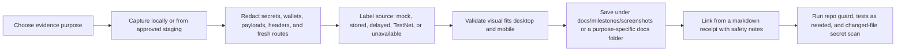

# Image And Visual Evidence Pipeline

Purpose: define the safe GitHub documentation pipeline for screenshots, diagrams, demo GIFs, and other visual evidence. This is a docs and evidence workflow only. It does not approve Mainnet, deployment, live trading, signer/wallet custody, payment execution, public eligibility claims, or production readiness claims.

## Scope

Use this pipeline for:

- dashboard screenshots
- milestone receipt screenshots
- architecture diagrams
- x402 gate diagrams
- short demo GIFs or terminal screenshots
- public-safe report previews

Do not use this pipeline to publish:

- `.env` contents
- mnemonics, private keys, seed phrases, wallet exports, or signer secrets
- full payment payloads, `PAYMENT-SIGNATURE` values, payment groups, authorization headers, or request headers
- fresh executable routes, live trading instructions, or signer-access screens
- Mainnet receiver/payment evidence unless a later gate explicitly approves public-safe evidence publication
- challenge eligibility, leaderboard, revenue, profit, yield, or production-readiness claims that have not passed human review

## Pipeline



## Required Metadata

Every visual evidence receipt should include:

- image path
- page or endpoint shown
- capture environment, such as local, stored, delayed, TestNet, or staging
- what changed
- what is mock or synthetic
- what is live, stored, delayed, or unavailable
- safety boundary, especially no signer, no wallet custody, no live execution, and no fresh executable route exposure
- blocked next gate, if relevant
- validation command or browser QA note

## File Placement

Preferred screenshot location:

```text
docs/milestones/screenshots/YYYY-MM-DD-short-description.png
```

Preferred milestone receipt location:

```text
docs/milestones/YYYY-MM-DD-short-description.md
```

For diagrams that are easier to review as text, prefer Mermaid inside Markdown before committing rendered images. GitHub can render Mermaid diagrams directly, and text diagrams are easier to diff.

## Redaction Checklist

Before committing an image or GIF:

- [ ] No mnemonic, private key, seed phrase, wallet export, signer secret, `.env` value, or API secret is visible.
- [ ] No full payment payload, payment group, `PAYMENT-SIGNATURE`, `X-PAYMENT`, authorization header, or raw request header is visible.
- [ ] No private wallet material or signer custody information is visible.
- [ ] No fresh executable route, live trade instruction, or transaction submission screen is visible.
- [ ] Any wallet address, tx reference, receiver, payer, or request ID is either public-safe for the current gate or redacted/hashed.
- [ ] TestNet evidence is labeled TestNet and not presented as Mainnet, challenge, leaderboard, or external-user evidence.
- [ ] Synthetic or mock visuals are labeled synthetic or mock.
- [ ] Delayed/redacted reports are labeled delayed/redacted.

## x402 Visual Rules

x402 visuals may show:

- endpoint path
- status codes such as `402` or `200`
- resource ID
- mode such as `mock`, `testnet-x402`, or `delayed`
- facilitator name
- response hash
- safety flags such as `publicSafe`, `liveExecutionTouched=false`, `signerCodeTouched=false`, `secretsPrinted=false`, and `paymentPayloadLogged=false`

x402 visuals must not show:

- private wallet material
- full payment payloads
- full payment headers
- payment group internals
- secrets or `.env` values
- unsupported Mainnet, eligibility, leaderboard, or public-claim wording

## GitHub Markdown Example

```markdown
## Screenshot


## Safety Notes

- Source: stored delayed local data.
- No signer, wallet custody, live execution, or fresh executable routes shown.
- Mock/TestNet/Mainnet status: local stored data only.
- Public claim status: no production, eligibility, revenue, or profit claim.
```

## Validation

For docs-only visual evidence changes, run:

```powershell
git diff --check
python scripts/repo_guard.py
python -m pytest -q
```

For dashboard screenshot changes, also run the local app and verify the target page in browser at desktop and mobile widths. Record console errors, overflow issues, and the exact route or tab in the milestone receipt.
