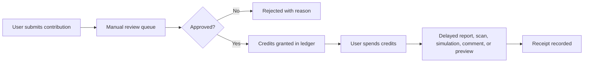
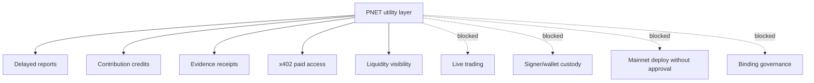
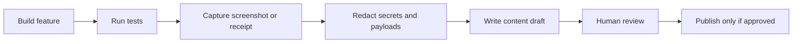
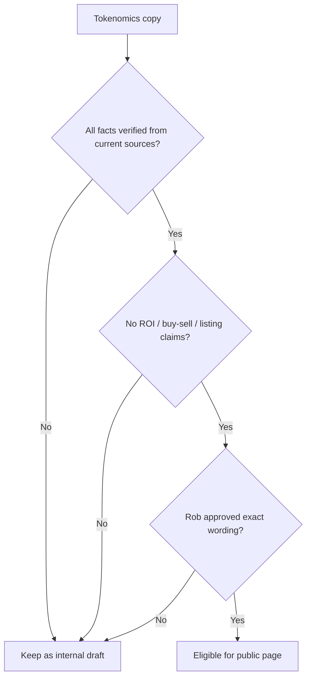

# PNET Visual Assets

Purpose: provide reusable diagram assets for docs, GitHub, website sections, blog posts, and presentations. Prefer Mermaid diagrams in GitHub until rendered images pass the `docs/IMAGE_PIPELINE.md` redaction checklist.

## Contribution Protocol Flow

Safety label: credits unlock bounded access only. They do not create token rewards, staking yield, treasury control, or trading permission.

## Utility Boundary

## Content Evidence Loop

## Tokenomics Content Gate

## Image Export Checklist

Before converting any diagram to PNG/GIF:

- [ ] No secrets, `.env`, keys, mnemonics, payment payloads, or raw headers.
- [ ] No fresh executable route data.
- [ ] No ROI, price, yield, buy/sell, CEX, audit, or production-readiness overclaim.
- [ ] Source label included: mock, local, delayed, TestNet, staged, or verified.
- [ ] Human approval recorded before public posting.
