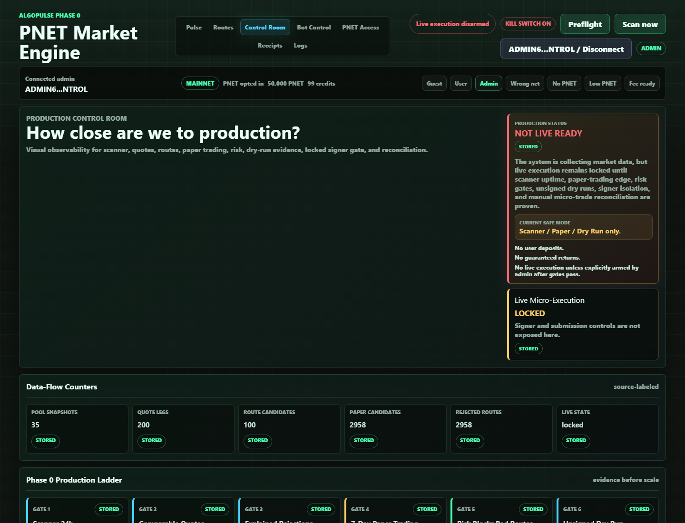

# Milestone Receipt: Control Room Live-Map Heartbeat

Date: 2026-06-22
Commit: `e9576e6`
Screenshot: `docs/milestones/screenshots/2026-06-22-control-room-live-map-heartbeat.png`

## What Changed

- Added a 5-second admin-only Control Room heartbeat against read-only `/api/ops/*` endpoints.
- Added service-node motion strips, node pulses, count deltas, and activity-tape movement.
- Added richer backend telemetry for quote legs, route candidates, risk rejections/approvals, paper expected-vs-simulated results, and phase evidence.
- Kept `Production Status: NOT LIVE READY` and `Live Micro-Execution LOCKED` visible in the first viewport.

## What Is Mock

- No current Control Room metric in this screenshot is labeled `mock`.
- The local admin wallet/session is still a local review mock, not production auth.
- Mock fallback telemetry exists only if `/api/ops/*` endpoints fail, and it is visibly labeled `mock`.

## What Is Live Or Stored

- Source badges in the screenshot show `stored`, meaning the dashboard is reading stored local Phase 0 telemetry.
- Current stored telemetry shown:
  - 35 pool snapshots
  - 200 quote legs
  - 100 route candidates
  - 2,958 paper candidates
  - 2/7 paper-trading collection days
  - Risk reviewed routes with most rejected by design

## What Is Still Blocked

- Live micro-execution remains locked.
- Signer remains disabled/not configured for this UI/control-plane milestone.
- Production is still NOT LIVE READY.
- Gate 4 still needs a full 7-day paper-trading window.
- Manual live micro-trade and reconciliation remain future gates.

## Production Gate Moved Forward

- Gate 9, delayed/public-safe dashboard observability, moved forward because the Control Room now shows motion, state, evidence, blockers, source labels, and live-lock reasons instead of static cards.
- No live execution gate moved forward.
