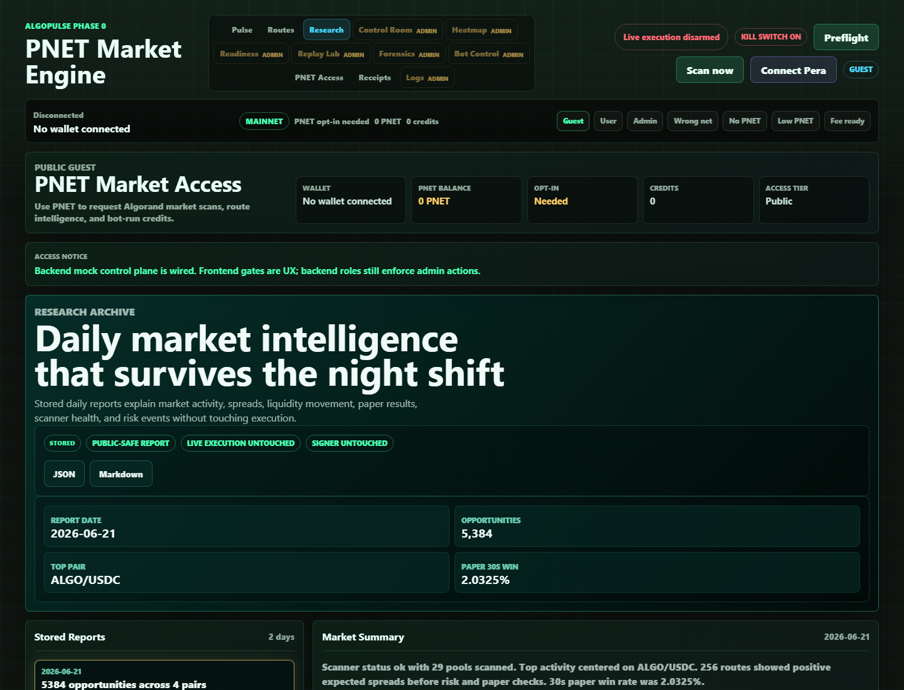

# Daily Market Intelligence Report

## Screenshot

## What Changed

- Added stored Daily Market Intelligence Reports with JSON and Markdown exports.
- Added the public-safe `Research` dashboard page for historical report browsing.
- Added `#research` dashboard deep-linking so handoffs and screenshots can open directly to the Research Archive.
- Added backend persistence for `market_intelligence_reports` and archive generation from stored market evidence.

## What Is Mock

- PNET wallet/access UI remains in local review mode for disconnected guest sessions.
- No mock market report is shown when stored reports load successfully.

## What Is Stored Or Live

- The Research Archive is using stored local market evidence, not live execution.
- Current stored archive includes 2026-06-21 and 2026-06-20 reports.
- Selected report evidence shows 5,384 opportunities, ALGO/USDC as top pair, scanner status ok, and 2.0325% 30s paper win rate.

## Still Blocked

- Live micro-execution remains disarmed.
- No signer, mnemonic, hot-wallet, or transaction submission code was changed.
- Production remains blocked on scanner uptime, multi-day paper trading, dry-run validation, signer isolation proof, and manual reconciliation.

## Production Gate Movement

- Phase 0G Public Dashboard moved forward: every day with stored market evidence can now explain market summary, top pairs, top spreads, liquidity changes, opportunity counts, route performance, paper performance, scanner health, and risk events.
- Phase 0D Paper Trading visibility improved through daily report rollups, but the 7-day paper-trading gate is still not complete.

## Verification

- Browser QA verified stored Research Archive data on `http://127.0.0.1:8766/#research`.
- Screenshot captured after stored reports loaded.
- Desktop and 390px mobile checks showed no mock fallback, no console errors, and no horizontal overflow.
- Full automated test results are recorded in the final Codex handoff for this milestone.
