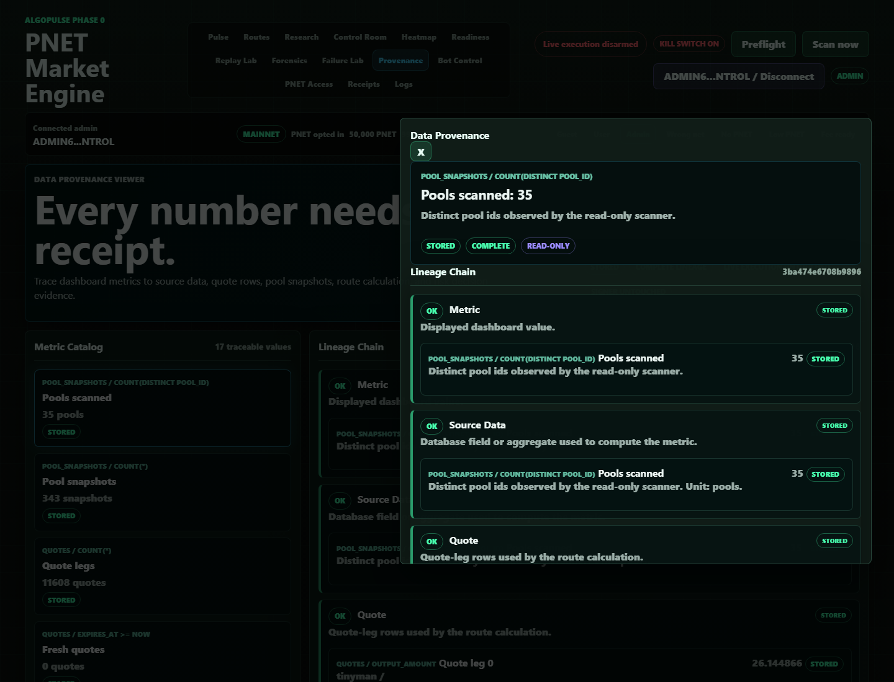

# Data Provenance Viewer

## Screenshot

## What Changed

- Added admin-only `GET /api/ops/provenance` for read-only dashboard metric lineage.
- Added the admin `Provenance` tab with 17 traceable metrics and a complete lineage chain.
- Added click-to-trace metric cards across the dashboard so a value can open the Data Provenance drawer.
- Added lineage steps for displayed metric, source data, quote rows, pool snapshots, route calculation, and risk decision.
- Added visible safety chips for stored/mock source, complete/missing evidence, read-only mode, live execution untouched, and signer untouched.

## What Is Mock

- The frontend has a mock-labeled fallback only if `/api/ops/provenance` is unavailable.
- Mock values are visibly labeled `mock` and do not pretend to be production data.

## What Is Live Or Stored

- The verified local view used stored backend records from the development database.
- Browser QA showed 17 stored traceable metrics, 6 lineage steps, and drawer evidence for metric, quote, pool snapshot, route calculation, and risk decision.

## Still Blocked

- Live execution remains disarmed.
- Signer remains disabled and untouched.
- Provenance is observability only; it does not submit, sign, queue, or arm transactions.

## Production Gate Movement

- Phase 0C Route Engine evidence improved: route calculations now have visible lineage.
- Phase 0E Risk Engine evidence improved: risk decisions can be traced from dashboard values.
- Phase 0G Public Dashboard groundwork improved: every displayed value can carry source evidence instead of being a dead-end card.

## Verification

- `python -m pytest -q`: 147 passed, 3 warnings.
- `node --check src\\algopulse\\static\\app.js`: passed.
- Browser QA on `http://127.0.0.1:8766/#provenance`: no console errors, guest gate enforced, drawer opened from a metric click, and no horizontal overflow at desktop or 390px mobile width.
