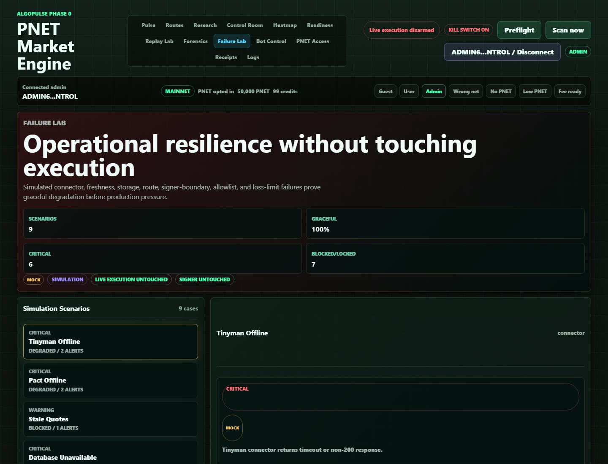

# Failure Simulation Mode

## Screenshot

## What Changed

- Added an admin-only Failure Lab for resilience drills.
- Added `GET /api/ops/failure-lab` with nine simulated failures: Tinyman offline, Pact offline, stale quotes, database unavailable, route engine crash, signer unavailable, unknown asset, unknown app ID, and daily loss breach.
- Added expected response, actual response, generated alerts, affected services, operator action, source labels, and graceful-degradation state for each scenario.
- Added backend role tests and pure simulation tests so the endpoint remains safe and admin-gated.

## What Is Mock

- All Failure Lab values are mock-labeled simulations.
- The lab does not intentionally take Tinyman, Pact, Postgres, signer, or any live dependency offline.

## What Is Live Or Stored

- The FastAPI control-plane endpoint is live locally on `http://127.0.0.1:8766/api/ops/failure-lab`.
- The dashboard page is live locally at `http://127.0.0.1:8766/#failure`.
- No live market execution or signer code is used by this feature.

## Still Blocked

- Live micro-execution remains disarmed.
- Signer isolation proof, unsigned dry-run validation, manual micro-trade reconciliation, and 7-day paper-trading evidence are still required before production execution.
- This milestone proves graceful UI/API degradation behavior only; it does not prove real connector failover under production load.

## Production Gate Movement

- Phase 0B/0E observability moved forward: operators can now rehearse connector, quote, database, route, signer-boundary, allowlist, and loss-limit failures without touching live execution.
- Gate 5 risk visibility improved because unknown asset, unknown app ID, and daily-loss breach scenarios show hard-stop behavior.

## Verification

- Browser QA verified the admin Failure Lab on `http://127.0.0.1:8766/#failure`.
- Guest mode cannot enter the Failure Lab.
- Desktop and 390px mobile checks showed nine scenarios, mock labels, live execution/signer untouched proof, no console errors, and no horizontal overflow.
- Screenshot captured after the live local endpoint returned all nine simulated scenarios.
