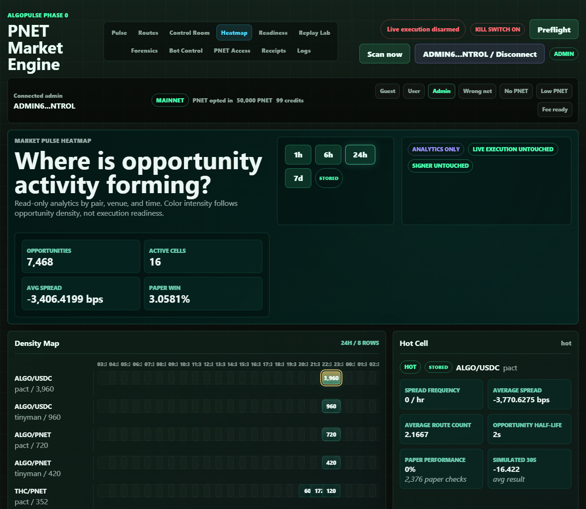

# Market Pulse Heatmap

## Screenshot

## What Changed

- Added pure Market Pulse Heatmap aggregation for opportunity activity by pair, venue, and time bucket.
- Added admin-only `GET /api/ops/market-heatmap` with 1h, 6h, 24h, and 7d views.
- Added the admin `Heatmap` tab with density cells, source badges, time-window controls, pair/venue summaries, hot-cell inspection, half-life, spread frequency, route-count, and paper-performance metrics.
- Added visible safety chips: Analytics only, Live execution untouched, and Signer untouched.

## What Is Mock

- The frontend has a mock-labeled fallback only if `/api/ops/market-heatmap` is unavailable.
- The verified local view used stored backend records, not the mock fallback.

## What Is Live Or Stored

- Local API returned stored heatmap data from persisted opportunities and paper-trade rows.
- Browser QA showed the 24h stored view with 16 pair/venue/time cells, 8 heatmap rows, stored source badges, 1 hot cell, and the selected-cell inspector.

## Still Blocked

- Live execution remains disarmed.
- Signer remains disabled and untouched.
- Heatmap analytics do not submit, sign, queue, or arm transactions.

## Production Gate Movement

- Phase 0C Route Engine evidence improved: route activity is now visible by pair, venue, and time.
- Phase 0D Paper Trading evidence improved: stored paper-performance metrics are visible per activity cell.
- Phase 0G Public Dashboard groundwork improved: delayed/public-safe market intelligence has a clearer analytics surface.

## Verification

- `python -m pytest -q`: 138 passed, 3 warnings.
- `node --check src\\algopulse\\static\\app.js`: passed.
- Browser QA on `http://127.0.0.1:8766/`: no console errors and no page-level horizontal overflow at desktop or 390px mobile width.
