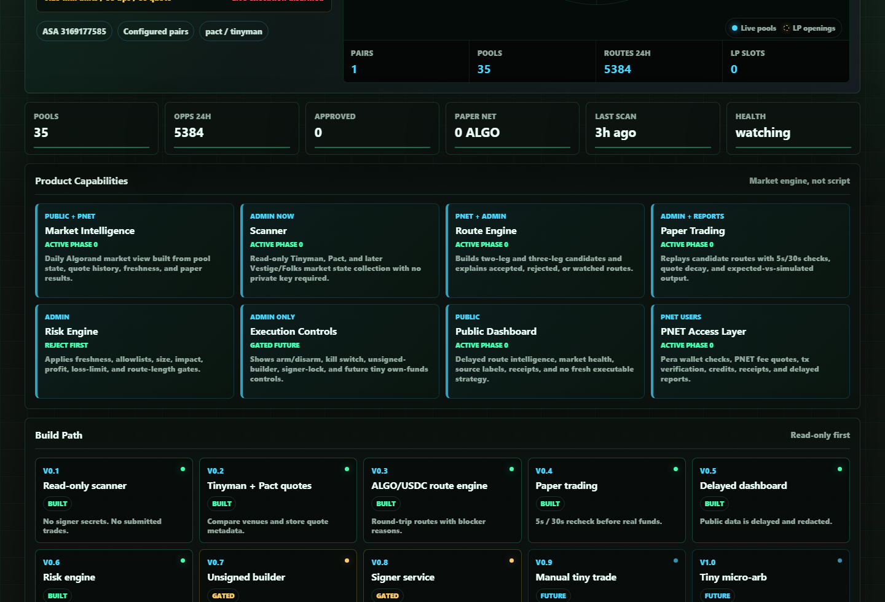

# Milestone Receipt: Product Pillars

Date: 2026-06-22
Screenshot: `docs/milestones/screenshots/2026-06-22-product-pillars.png`

## What Changed

- Aligned the public product capability catalog to eight product pillars: market intelligence, scanner, route engine, paper trading, risk engine, execution controls, public dashboard, and PNET access layer.
- Updated backend public config, frontend fallback copy, docs, tests, and handoff notes to use the same product scope.
- Reframed execution as controls and locked gates, not as the product itself.

## What Is Mock

- The local wallet/session remains a review-mode UI fixture.
- Frontend fallback capability copy is only used when `/api/config/public` is unavailable.

## What Is Live Or Stored

- The dashboard reads the capability list from stored backend public config.
- Screenshot QA confirmed all eight cards render in the Product Capabilities panel.

## What Is Still Blocked

- Live execution remains locked.
- Signer, hot-wallet, mnemonic handling, and transaction submission remain untouched.
- Execution controls remain a gated future surface until production gates pass.

## Production Gate Moved Forward

- Phase 1 product clarity moved forward because the app now names the actual platform surfaces instead of presenting itself as only an arb script.
- No live execution gate moved forward.

## Verification

- Public config test asserts the eight product pillar codes.
- Browser QA confirmed eight capability cards, no old top-level capability names, and no horizontal overflow.
