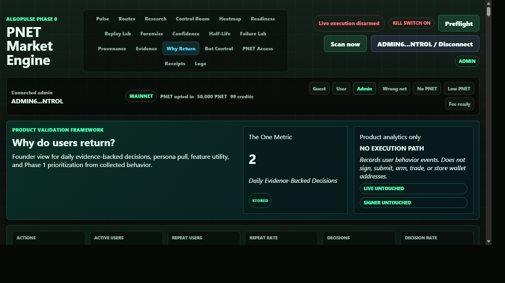

# Product Validation Engine

## Screenshot

## What Changed

- Added an approved user-action taxonomy for meaningful product behavior such as market pulse views, route opens, route forensics, replay, reports, receipts, scans, simulations, alerts, project pages, liquidity health, and exports.
- Added `user_actions` and `decision_events` storage. Decision events are created only for evidence-backed interactions, not page loads, scrolling, or idle time.
- Added safe public collection through `POST /api/events/user-action` and admin-only reporting through `GET /api/ops/product-validation`.
- Added the admin `Why Return` tab with product funnel analytics, persona validation, feature utility ranking, dead-feature detection, and the `Why Users Return` founder view.
- Added tests for taxonomy validation, decision generation, admin-only report access, aggregation math, and storage schema.

## What Is Mock

- The frontend has a mock-labeled fallback only if `/api/ops/product-validation` is unavailable.
- Mock values are visibly labeled `mock` and do not pretend to be stored behavior.

## What Is Live Or Stored

- Local QA used stored `user_actions` and `decision_events` from the development database.
- The admin `Why Return` view showed stored source labels, 2 evidence-backed decisions, the product funnel, persona validation, feature ranking, dead-feature recommendations, and the action taxonomy.
- The public event endpoint rejects unknown actions such as `page_load` so passive browsing does not become fake decision evidence.

## Still Blocked

- Live execution remains disarmed.
- Signer remains disabled and untouched.
- This validates product usage only; it does not sign, submit, queue, arm, or change transaction execution.
- Phase 1 product decisions should wait for more real user history before treating the current local sample as directional.

## Production Gate Movement

- Gate 10 improved: Phase 1 decisions can now be tied to real product behavior instead of founder assumptions.
- Phase 0G improved: the dashboard now explains not only market readiness, but whether users are finding recurring value.
- No live-trading gate moved; this is analytics/control-plane evidence only.

## Verification

- `python -m pytest tests\\test_product_validation.py tests\\test_store.py tests\\test_control_plane_api.py -q`: 30 passed, 3 warnings.
- `python -m pytest -q`: 156 passed, 3 warnings.
- `node --check src\\algopulse\\static\\app.js`: passed.
- `git diff --check`: passed.
- Diff guard for signer, executor, transaction builder, and env example files: no changes.
- Browser/headless QA on `http://127.0.0.1:8766/#validation`: admin view rendered the validation hero, stored source labels, product funnel, no-execution safety copy, and no desktop or 390px mobile overflow. Guest role could not render the validation hero. No console/runtime errors were observed.
