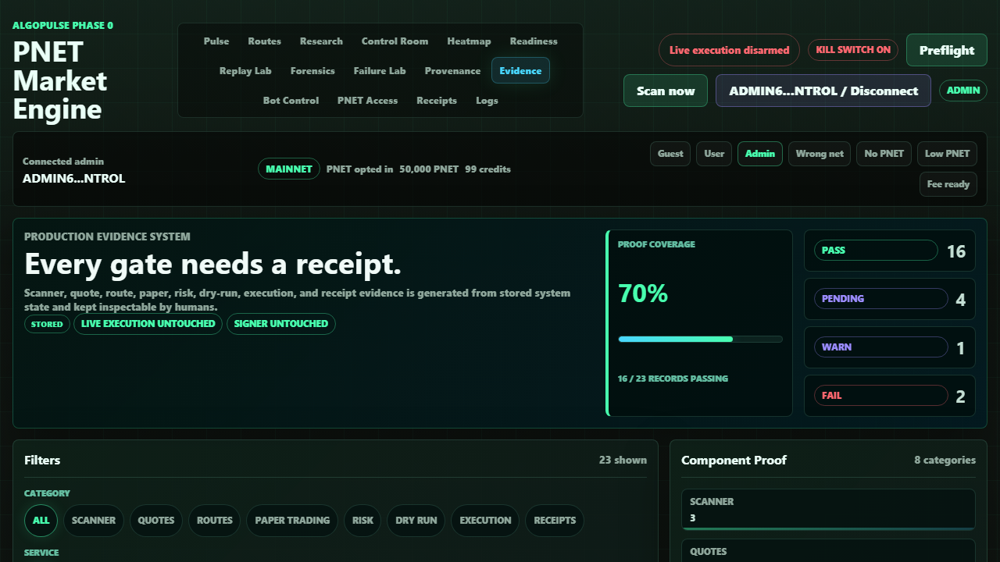

# Production Evidence System

## Screenshot

## What Changed

- Added `evidence_records` as a production proof ledger with `evidence_id`, service, category, title, summary, status, created time, and metadata JSON.
- Added deterministic evidence generation for scanner, quotes, routes, paper trading, risk, dry run, execution controls, and receipts.
- Added admin-only `GET /api/ops/evidence` with backend filters for category, service, and status.
- Added the admin `Evidence` tab with proof coverage, category counts, filter chips, evidence record cards, and a metadata inspector.
- Added tests for table creation, evidence generation, filtering, empty-state pending evidence, and admin-only API access.

## What Is Mock

- The frontend has a mock-labeled fallback only if `/api/ops/evidence` is unavailable.
- Verified QA used stored backend evidence records, not the mock fallback.

## What Is Live Or Stored

- Local API generated and persisted 23 stored evidence records from the current development database.
- Evidence covered 8 categories and 9 services.
- Browser QA confirmed stored labels, route-category filtering, fail-status filtering, and metadata inspection.

## Still Blocked

- Live execution remains disarmed.
- Signer remains disabled and untouched.
- Dry-run receipts, payment verification receipts, and reconciliation records remain pending until those systems produce stored proof.

## Production Gate Movement

- Phase 0B Scanner evidence is easier to prove with stored scanner records.
- Phase 0C/0E route and risk evidence now have an auditable proof ledger outside individual feature pages.
- Phase 0G dashboard readiness improved because a human can filter and inspect evidence records for every major component.

## Verification

- `python -m pytest tests\\test_evidence_system.py tests\\test_store.py tests\\test_control_plane_api.py -q`: 28 passed, 3 warnings.
- Browser QA on `http://127.0.0.1:8766/#evidence`: 23 stored evidence records, route filter to 3 route records, fail filter to 2 records, guest lock enforced, no console errors, and no horizontal overflow at desktop or 390px mobile width.
