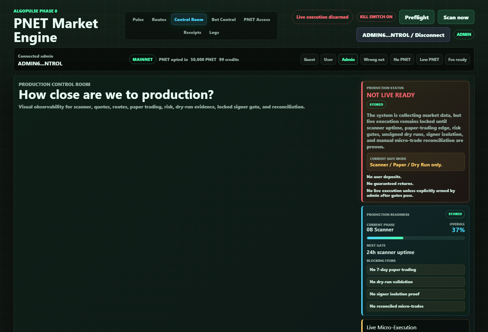

# Milestone Receipt: Production Readiness 0B

Date: 2026-06-22
Screenshot: `docs/milestones/screenshots/2026-06-22-production-readiness-0b.png`

## What Changed

- Added a `productionReadiness` contract to safe `/api/ops/*` responses.
- Added a Control Room readiness card showing current phase `0B Scanner`, overall `37%`, next gate `24h scanner uptime`, and the active blockers.
- Added the same current-readiness status to production readiness docs and handoff notes.

## What Is Mock

- Frontend fallback still produces visibly labeled `mock` readiness if ops endpoints are unavailable.
- The local admin wallet preset is still a review-mode UI fixture, not production authentication.

## What Is Live Or Stored

- The screenshot uses stored local backend telemetry.
- The readiness summary is stored/source-labeled in the Control Room and API payloads.
- No live scanner, signer, hot-wallet, or transaction-submission behavior was added.

## What Is Still Blocked

- No 7-day paper trading.
- No dry-run validation.
- No signer isolation proof.
- No reconciled micro-trades.
- Live micro-execution remains locked.

## Production Gate Moved Forward

- Gate 9 dashboard observability moved forward because the Control Room now gives a clear answer to current phase, overall readiness, next gate, and blockers.
- No live execution gate moved forward.

## Verification

- API test asserted Phase 0B, 37%, next gate, and blocker values.
- Browser QA confirmed the readiness card rendered from stored data with no console errors.
- Mobile QA at 390px confirmed the card stayed readable with no horizontal overflow.
- Screenshot capture confirmed stored source label, live lock state, and all blockers visible.
