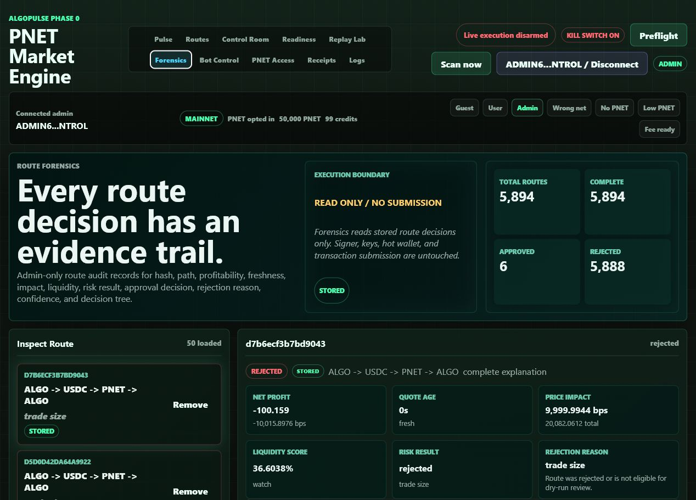

# Route Forensics

## Screenshot

## What Changed

- Added persisted `route_forensics` audit records for stored opportunities.
- Added route decision explanations with route hash, path, profitability, quote freshness, price impact, liquidity score, risk result, approval decision, rejection reason, confidence calculation, decision tree, and completeness status.
- Added admin-only `GET /api/ops/route-forensics`.
- Added the admin `Forensics` tab for route inspection, comparison, confidence math, risk-rule evidence, and decision-tree review.

## What Is Mock

- The frontend has a mock-labeled fallback only if `/api/ops/route-forensics` is unavailable.
- The verified local view used stored backend records, not the mock fallback.

## What Is Live Or Stored

- Local API returned 5,894 stored route explanations.
- Browser QA showed 50 loaded stored route cards, 3 compare cards, 7 selected-route decision steps, and stored source badges.

## Still Blocked

- Live execution remains disarmed.
- Signer remains disabled.
- Route forensics is observability only; it does not submit, sign, or arm transactions.

## Production Gate Movement

- Phase 0C Route Engine evidence improved: route candidates now have complete stored explanations and rejection reasons.
- Phase 0E Risk Engine evidence improved: risk result, failed rules, and rejection reasons are inspectable per route.

## Verification

- `python -m pytest -q`: 135 passed, 3 warnings.
- `node --check src\\algopulse\\static\\app.js`: passed.
- Browser QA on `http://127.0.0.1:8766/`: no console errors and no horizontal overflow at desktop or 390px mobile width.
