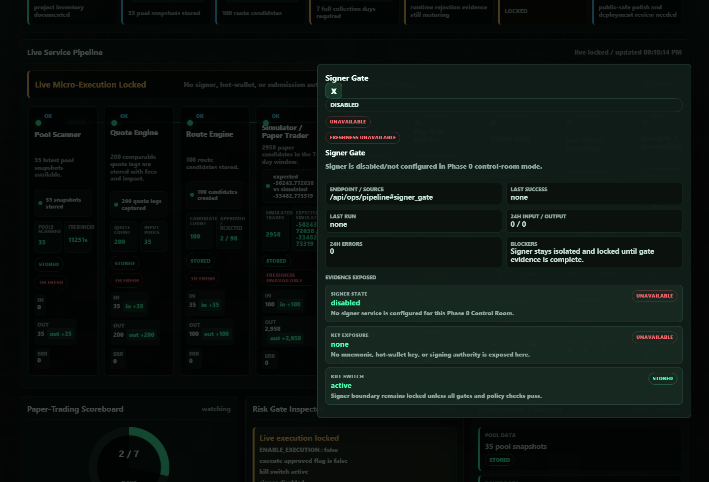

# Milestone Receipt: Service Evidence Contract

Date: 2026-06-22
Screenshot: `docs/milestones/screenshots/2026-06-22-service-evidence-contract.png`

## What Changed

- Added structured evidence rows to every Control Room pipeline service.
- Scanner, quote engine, route engine, risk engine, paper trader, dry-run builder, signer gate, live micro-execution, and receipts now expose operator-readable evidence.
- Service cards show compact evidence previews; the Evidence Drawer shows full rows with label, value, detail, and source.
- The signer drawer explicitly shows disabled state, no key exposure, and active kill-switch evidence.

## What Is Mock

- Mock fallback evidence still exists only when the admin ops endpoints are unavailable.
- Mock fallback rows are visibly labeled `mock`.
- The local admin wallet preset remains a review-mode UI fixture, not production authentication.

## What Is Live Or Stored

- The screenshot uses stored local backend telemetry from `/api/ops/pipeline`.
- Stored evidence visible in the Control Room includes 35 pool snapshots, 200 quote legs, 100 route candidates, 2,958 simulated paper candidates, and risk rejection counts.
- No live scanner, signer, hot-wallet, or transaction-submission behavior was added.

## What Is Still Blocked

- Live micro-execution remains locked.
- Signer remains disabled/not configured.
- Gate evidence for 24h scanner uptime, 7-day paper trading, dry-run receipts, signer isolation, and manual reconciliation is still incomplete.
- Mnemonics, private keys, hot-wallet logic, signer code, and live transaction submission remain untouched.

## Production Gate Moved Forward

- Gate 9, delayed/public-safe dashboard observability, moved forward because completed pipeline features now show evidence instead of only status.
- Gate 3 route rejection explainability moved forward in the Control Room because rejection reasons are surfaced as first-class evidence.
- No live execution gate moved forward.

## Verification

- Browser QA confirmed 9 service nodes, 18 evidence preview chips, full Evidence Drawer rows, signer disabled/no-key-exposure/kill-switch evidence, and no horizontal overflow.
- Mobile QA at 390px confirmed all service evidence remained present with no horizontal overflow.
- Screenshot capture confirmed 9 services, 18 evidence chips, signer drawer open, no missing evidence labels, and no horizontal overflow.
